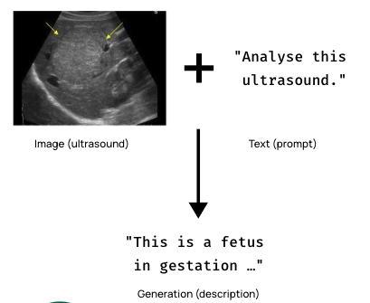

# **Model Details**

BabyDoctor is a multimodal large language model (MLLM) that merges the capabilities of CLiP and LLaMA 2 to understand and generate text, as well as understand images. It's a three-step fine-tuned model following a ULMFit-esque method:

1. **Pretraining**: LLaMA 2-7B Chat and CLiP pretrained on 2T tokens and 1-100M images, by Meta AI and OpenAI, respectively.
2. **Instruction following**: LLaVA projects CLiP onto LLaMa 2 with a matrix (mapping CLiP's embedding dim onto LLaMa 2's embedding dim). Synthetic GPT-4 instruction-following data teaches LLaVA to interpret images.
3. **Domain Adaptation (Ours)**: BabyDoctor tunes LLaVA to interpret radiology (i.e. X-ray, ultrasound, MRI, CT scan) images in medical lingo.

**Model Developers** Markus Zhang and Vir Chau

**Input** An image (i.e. ultrasound scan) and text (i.e. prompt).

**Output** Generation (i.e. text description of image).

  

**Model Architecture** BabyDoctor is an auto-regressive language model that uses an optimized transformer architecture combined with a vision encoder. The tuned versions use supervised fine-tuning (SFT), Low-Rank Adaptation (LoRA), and Quantized LoRA (QLoRA) for improved specialization in the medical domain.

- Base LLM: LLaMA-2-7B-Chat
- Base Vision Encoder: CLIP-L
- Pretraining Data: LCS-558K
- Pretraining Schedule: 1e
- Finetuning Data 1: - LLaVA-Instruct-80K
- Finetuning Schedule 1: lora (low rank domain adaptation) 1 epoch
- Finetuning data 2: [roco-instruct-65k](https://huggingface.co/datasets/photonmz/roco-instruct-65k)
- Finetuning Schedule: quantised lora (qlora) 1 epoch 4-bit

**Model Dates** BabyDoctor was trained on July 2023.

**License** Academic research only. Subject to LLaMa 2, CLiP, GPT-4, and LLaVA licenses.

**Where to send questions or comments about the model** Submit an issue on GitHub.

# **Intended Use**

**Intended Use Cases** BabyDoctor is intended for research use in English. The model is primarily designed for assistant-like chat within the medical and health domain.

**Out-of-scope Uses** Use in any manner that violates applicable laws or regulations (including trade compliance laws). Use in languages other than English. Use in any other way that is prohibited by the Acceptable Use Policy and Licensing Agreement for BabyDoctor. BabyDoctor is not ready for production user-facing use cases and needs further tuning.

# **Hardware and Software**

**Training Factors** We used LLaVA training scripts and Lambda Labs' 1xA10 cloud GPUs (8 hours) for fine-tuning, inference, and web serving.

# **Training Data**

**Overview** BabyDoctor is built on LLaMa 2, Meta's latest model pretrained on 2 trillion tokens of data from publicly available sources. The fine-tuning data includes LLaVA-Instruct-80K and Roco-Instruct-65K, which are instruction-following and medical-related datasets respectively. None of the pretraining or the fine-tuning datasets include Meta user data.

**Data Freshness** The pretraining data has a cutoff of September 2022, but some tuning data is more recent, up to July 2023.

_Note: Since the BabyDoctor model was designed for a very specific purpose, it has not been evaluated on as wide a range of tasks as the LLaMA 2 models._

# **Ethical Considerations and Limitations**

BabyDoctor, while aimed at providing helpful medical and health-related advice, should not be considered a replacement for professional medical advice. Additionally, while it has been trained on a large variety of health-related topics, there may be areas of medicine or health that it doesn't cover as accurately. It's essential to remember that while this model aims to provide accurate information, it does not have access to individual health records or specific patient information, and its advice should not replace a consultation with a healthcare professional.
