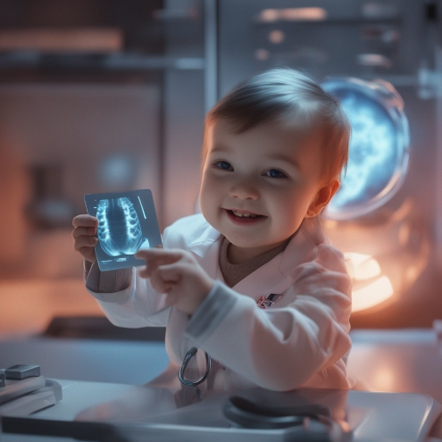
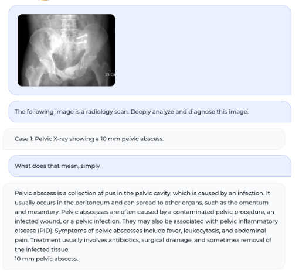

# 🩻 BabyDoctor

_The AI Radiologist You Can Chat With_

  

 

Welcome to BabyDoctor, your personal "Ultrasound Radiologist in a Box"! Let's face it, most of us try to avoid seeing the doctor as much as we can, especially when it involves cryptic ultrasound scans. BabyDoctor is here to bridge the gap and demystify medical jargon for you.

BabyDoctor uses a [LLaVA](https://llava-vl.github.io/) (Large Language and Vision Assistant) to generate ultrasound analysis. It's a combination of the cutting-edge LLaMa 2 text generator and OpenAI's CLiP for image embedding. The model was fine-tuned for ultrasound scans with a dataset of 65,000 text-image pairs, and trained using a 4-bit quantised LoRA on a Lambda Labs' A10 GPU for 8 hours.

    <a href="https://www.loom.com/share/54c1f5ed36f74914b689695dae9e8e20">
      
Demo

    </a>
    
  

## 🚼 Reproduce

To reproduce the results with BabyDoctor, follow these steps on a system with at least 16 vCPUs, 32GB RAM, and a NVIDIA GPU of >12GB VRAM:

1. Clone the repository: `git clone https://github.com/<username>/babydoctor.git`
2. Install CUDA following [the official NVIDIA setup instructions](https://docs.nvidia.com/cuda/cuda-installation-guide-linux/index.html#ubuntu).
3. Install Conda.
4. Run `mkdir -p ~/git; cd ~/git`.
5. Clone this repository into `~/git/BabyDoctor`.
6. Run `conda env create -f BabyDoctor/llmenv.yaml`. This will take a while.
7. Run `conda activate llmforbio`. From this step onward, execute all commands under this environment.
8. Run `MAX_JOBS=8 python3 -m pip install flash-attn`.
9. Download the dataset: `git clone https://github.com/razorx89/roco-dataset; cd roco-dataset; python3 scripts/fetch.py; popd`.
10. Prepare training data: `python3 BabyDoctor/scripts/massage_data.py`.
11. Start fine-tuning: `mv BabyDoctor/finetune.sh .; bash finetune.sh`. This took 8 hours on the A10.
12. Modify and run `./BabyDoctor/scripts/inference.sh` to prompt it!

A Web UI is available following instructions from [the BabyDoctor repository](https://github.com/haotian-liu/BabyDoctor/tree/main#gradio-web-ui).

  

## 🧪 Curious?

Try running BabyDoctor on your own ultrasound scans or experiment with different prompts. Let's see how well BabyDoctor can bridge the language gap between medical jargon and everyday English for you. You might be surprised!

And, of course, contributions to improve BabyDoctor are always welcome.

Check out these links for more details:

- [Base LLaVA model used for fine-tuning](https://huggingface.co/kaelee/llava-llama-2-7b-chat-finetuning)
- [Base LLaVA repository this was forked from](https://github.com/haotian-liu/LLaVA)
- [This Model Card](./MODEL_CARD.md)

## 🤝 Contributing

We welcome contributions to BabyDoctor! If you have a feature request, bug report, or proposal, please submit an issue. If you wish to contribute code, please fork this repository and submit a pull request.

## 📜 License

BabyDoctor is subject to the licenses of Meta's LLaMa 2, OpenAI's CLiP, OpenAI's GPT-4 User License Agreement, and LLaVa. Our data, code and checkpoints is intended and licensed for research use only.
